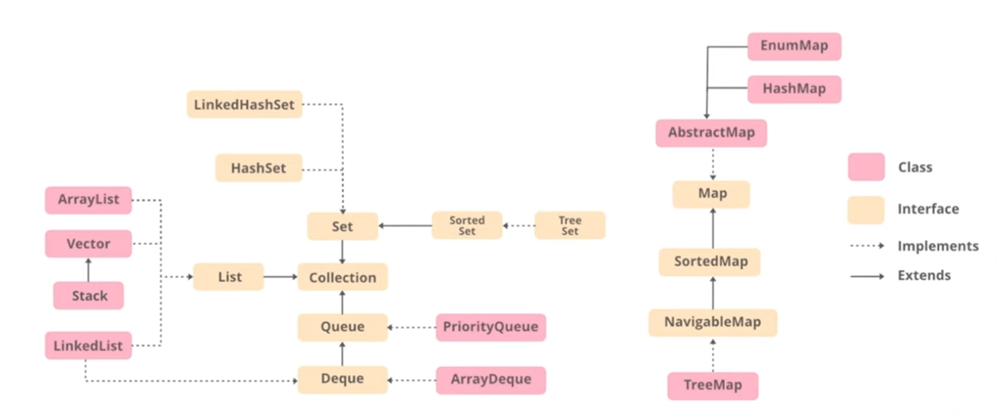

# Learn the basics (Step 1)

## 1.1. Things to know about any programming language

It begins with learning basics about any of the programming languages that you wish. 
For this, I have chosen **Java** as the programming language. 
The core concepts, logic remains the same and applicable across all programming languages. Only the code / syntax will be different, depending upon the programming language you choose.

In this section, we learned pretty basic concepts including:

- User input/output
- Datatypes and Operators
- Conditional statements (if, if-else, switch)
- Loops (for, while, do-while)
- Object-Oriented Programming (OOP) and its key concepts
- Arrays and Strings
- Methods (also called functions in C/C++/other programming languages)
- Pass by Reference, Pass by Value (these two concepts are not applicable in Java)
- Basics of time complexity and space complexity

### Resources for Java and Time Complexity:

- [Java Programming](https://www.youtube.com/playlist?list=PLsyeobzWxl7pe_IiTfNyr55kwJPWbgxB5)
- [Time Complexity and Space Complexity](https://takeuforward.org/time-complexity/time-and-space-complexity-strivers-a2z-dsa-course/)

## 1.2. Build up Logical Thinking

Pattern problems are typically not featured in interviews at product-based companies, though they may appear in coding rounds or interviews in service-based companies. They serve as a foundation for advanced topics. 
The primary purpose of these pattern exercises is to develop logical reasoning skills that will be valuable when tackling more advanced topics.

To solve any pattern problem, you must follow these below steps:
1. Observe symmetry in the pattern (_This is optional, applicable only if there is a symmetry in the pattern_)
2. For the outer loop, count the number of rows.
3. For the inner loop, count the number of columns and find out a relation between rows and columns.
4. Perform computation as specified in the exercise and print accordingly.

## 1.3. Java Collections

Java Collections Framework provides a unified set of interfaces and classes for storing and manipulating groups of objects efficiently. It's essential for data handling in Java applications.

- **Collection API:** Interfaces (`List`, `Set`, `Map`,etc.) that define what operations collections should support.
- **Collections Class:** Utility class with static methods for sorting, searching, and manipulating collections.
- **Collections Framework:**  Complete ecosystem including interfaces, implementations (ArrayList, HashMap), and utility methods.

The flow diagram of Java Collections Framework is given in the figure below:

While Java provides built-in collection implementations, understanding two key aspects is essential:

- **Internal Implementation:** How Java's data structures work under the hood.
- **Custom Implementation:** Building data structures from scratch (crucial for interviews and beneficial for understanding data structures).

> For Java developers, first master how built-in data structures work internally. Then apply this knowledge to implement these same structures from scratch.

### Resources for Java Collections:

- [Java Collections Framework and implementation of each data structure](https://www.youtube.com/watch?v=9ogGan-R1pc&list=PL9gnSGHSqcnr_DxHsP7AW9ftq0AtAyYqJ&index=43)

## 1.4. Basic Maths

This section consists of practicing problems related to the following topics:

- Counting the number of digits
- Reverse a number
- Check whether a number is a palindrome
- Check whether a number is an Armstrong number
- Count / print the number of divisors of a given number
- Check whether a given number is prime number or not
- Find GCD / HCF of 2 numbers

## 1.5. Basic Recursion

This is a very important topic, and I would recommend learning it in great detail. It is important to understand recursion as it serves as the foundation for advanced topics like:
- Graphs 
- Trees 
- Dynamic programming 
- Divide-and-conquer algorithms, etc.

### Resources for Recursion:

- [Recursion Basics](https://takeuforward.org/recursion/introduction-to-recursion-understand-recursion-by-printing-something-n-times/)
- [Recursion (Basics to Advanced) Playlist](https://www.youtube.com/playlist?list=PLgUwDviBIf0rGlzIn_7rsaR2FQ5e6ZOL9)

## 1.6. Basic Hashing

Hashing is a process that uses a mathematical hash function to convert input data of any size into a fixed-size output, called a hash value, for uses like fast data retrieval and security. In data structures, hashing allows for efficient storage and quick access to data in a hash table, aiming for O(1) average time for operations

### Resources for Hashing:

- [Hashing Basics](https://www.youtube.com/watch?v=KEs5UyBJ39g)

## Important Questions

| Topic           | Rating | Question           | Solution Link                  | Date          |
|-----------------|--------|--------------------|--------------------------------|---------------|
| Basic Maths     | Easy   | Divisors           | [Here](./lec4/Divisors6.java)  | 12th Sep 2025 |
| Basic Maths     | Easy   | GCD or HCF         | [Here](./lec4/GcdHcf4.java)    | 12th Sep 2025 |  
| Basic Recursion | Easy   | Reversing an Array | [Here](./lec5/Recursion7.java) | 13th Sep 2025 |  
| Basic Recursion | Easy   | Palindrome String  | [Here](./lec5/Recursion8.java) | 13th Sep 2025 |  
| Basic Recursion | Easy   | Fibonacci Series   | [Here](./lec5/Recursion9.java) | 13th Sep 2025 |  

